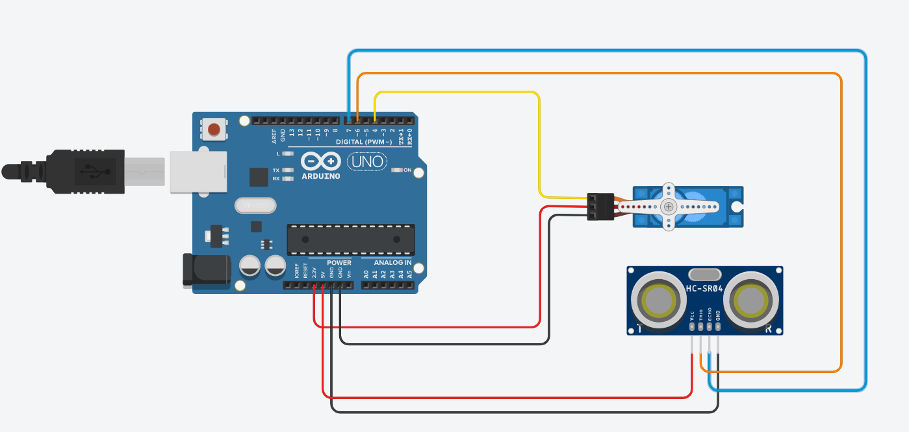

# Servo Motor acionado por aproximação

Você tem preguiça de apertar um interruptor?
Seus problemas acabaram!!!! 

O projeto apresentado liga e desliga seu interruptor. Basta aproximar sua mão a uma distância menor que 8 cm que o motor faz isso por você.

### Materiais:
- Motor servo DXW90;
- Sensor de distância HC-SR04;
- Jumpers;
- Arduíno Uno;

### Circuito

